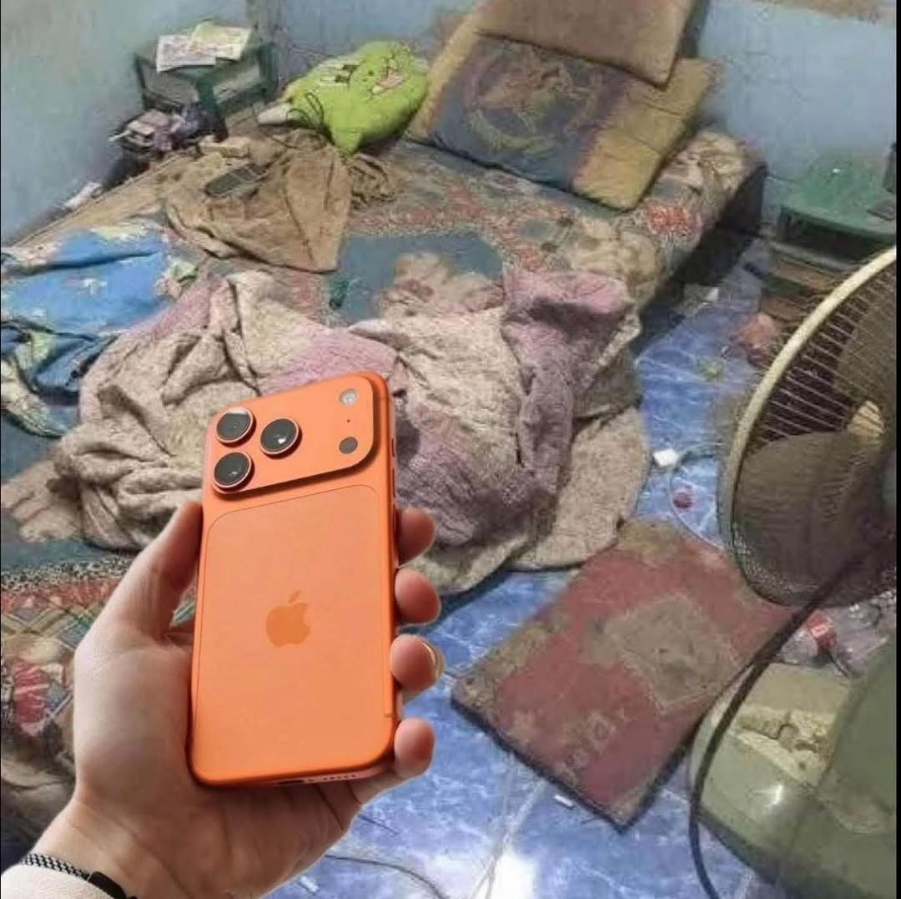
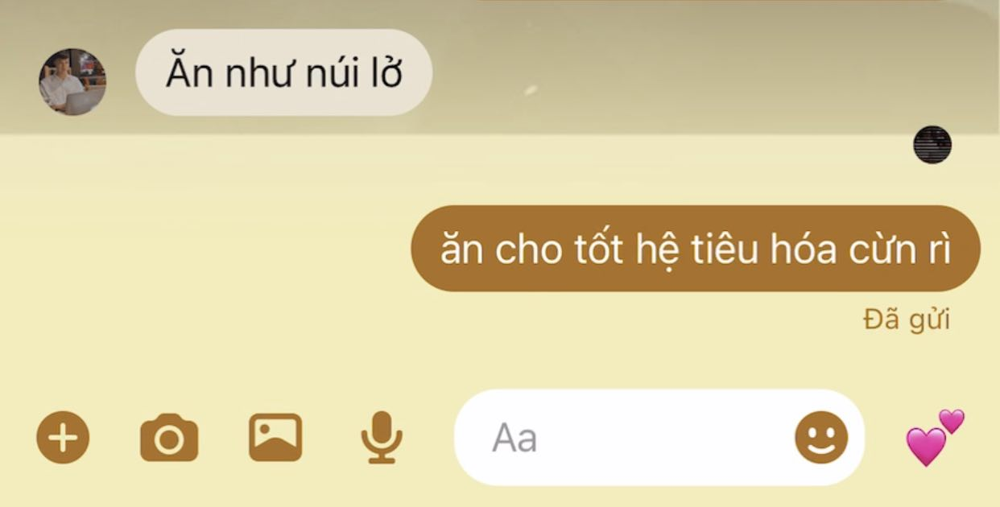
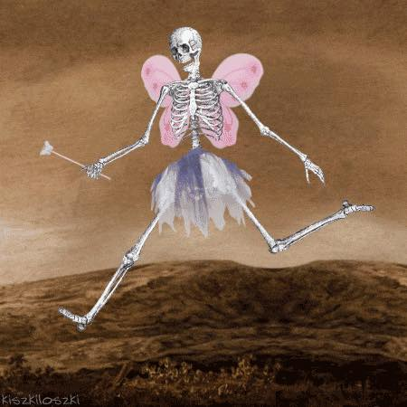
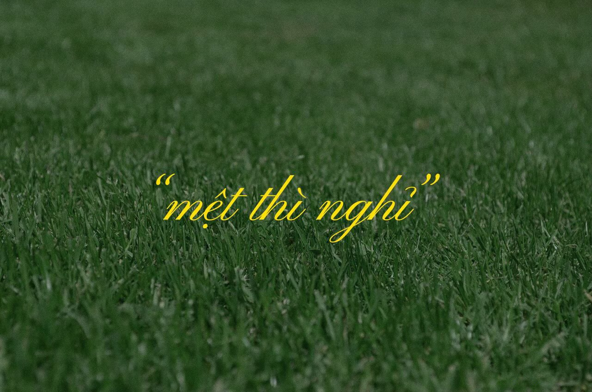
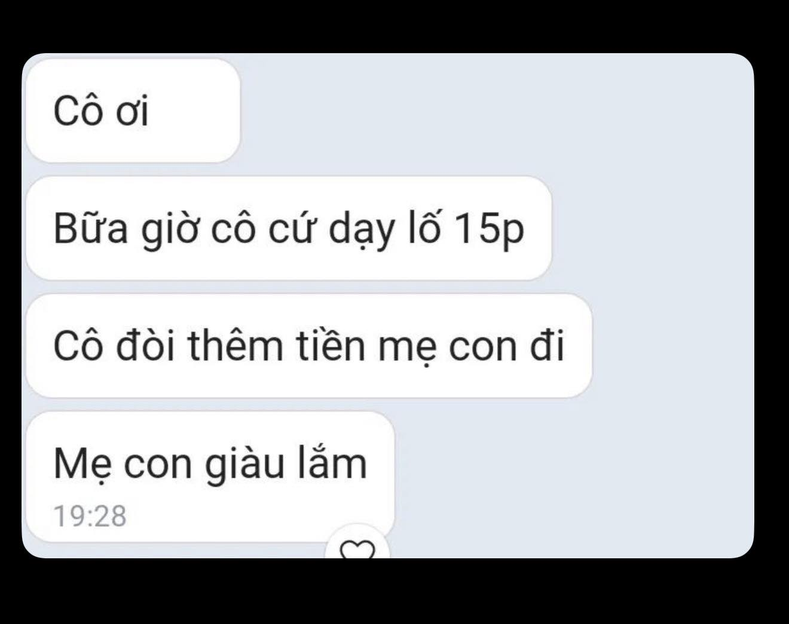

# Appendix

This appendix provides camera-ready supplementary material for ViMMSarc-Fine: detailed benchmark settings, dataset comparisons, split and subset counts, qualitative cases, uncertainty notes, anonymisation scope, and the two annotation prompts. The main paper is the primary source for reported conclusions.

> Five manually reviewed test images are embedded only where they are needed to interpret the qualitative cases. No readable names or handles are visible; ID 308 retains two small avatar thumbnails. The remaining examples use opaque internal IDs and paraphrased descriptions.

## Camera-ready benchmark details

All trained models below predict the same binary `mm_label` and report mean ± sample SD over seeds 42, 123, and 2026. Qwen3-VL-8B is zero-shot and reports one deterministic score. Earlier single-run Accuracy/AUC values are not mixed with these camera-ready aggregations.

### Text-only

| Model | s1 | s2 | s3 | s4 |
|---|---:|---:|---:|---:|
| RoBERTa-base | 0.6726 ± 0.0178 | 0.6476 ± 0.0015 | **0.6751 ± 0.0106** | 0.6537 ± 0.0032 |
| PhoBERT-base | 0.6747 ± 0.0094 | 0.6586 ± 0.0028 | 0.6633 ± 0.0090 | 0.6591 ± 0.0111 |
| mBERT | 0.6684 ± 0.0097 | 0.6539 ± 0.0041 | 0.6514 ± 0.0179 | 0.6530 ± 0.0164 |
| XLM-RoBERTa-base | **0.6818 ± 0.0086** | **0.6644 ± 0.0077** | 0.6712 ± 0.0017 | **0.6683 ± 0.0108** |
| ViCLSR | 0.6336 ± 0.0132 | 0.6322 ± 0.0136 | 0.6440 ± 0.0074 | 0.6358 ± 0.0114 |

### Image-only

| Model | s1 | s2 | s3 | s4 |
|---|---:|---:|---:|---:|
| ViT-B/32 | 0.6222 ± 0.0446 | -- | -- | -- |

### Multimodal

| Model | s1 | s2 | s3 | s4 |
|---|---:|---:|---:|---:|
| DT4MID | 0.6430 ± 0.0301 | **0.6730 ± 0.0103** | **0.6739 ± 0.0103** | **0.6777 ± 0.0051** |
| CIRM | 0.6584 ± 0.0054 | 0.6522 ± 0.0267 | 0.6538 ± 0.0236 | 0.6402 ± 0.0346 |
| Qwen3-VL-8B | 0.5734 | 0.5908 | 0.5734 | 0.5908 |
| ViMMSD-B (cross-attention) | 0.4933 ± 0.1179 | 0.5457 ± 0.0174 | 0.5625 ± 0.0555 | 0.5289 ± 0.0132 |
| ViMMSD-C (fusion) | **0.6766 ± 0.0085** | 0.6518 ± 0.0146 | 0.6578 ± 0.0079 | 0.6718 ± 0.0125 |

*Table: Test F1-macro by preprocessing scenario. Bold marks the best verified mean per group and scenario.*

## Experimental hyperparameters

| Item | Setting |
|---|---|
| Data split | Train/Dev/Test = 5,884/735/736, fixed for the benchmark |
| Target and selection | `mm_label`; checkpoint selected by Dev F1-macro |
| Seeds | 42, 123, 2026 |
| Optimisation | AdamW; learning rate $2\times10^{-5}$; weight decay 0.01 |
| Training | At most 10 epochs; early-stopping patience 2 |
| Text encoders | train/eval batch 16/32; 256 tokens |
| ViCLSR | train/eval batch 2/8; 256 tokens |
| CIRM | train/eval batch 4/8; 256 tokens |
| DT4MID and ViMMSD | train/eval batch 8/16; 128 tokens in the scenario benchmark |
| Image models | train/eval batch 16/32 |
| Controlled OCR batch | s1; 256-token text limit, including DT4MID |

The scenario benchmark and controlled OCR/platform experiments are separate batches. Their absolute scores should not be interchanged; OCR effects are interpreted only through matched comparisons within the controlled batch.

## Cross-dataset comparison

| Dataset | Language / source | N | Label space | OCR | Quality control / validation |
|---|---|---:|---|---|---|
| MMSD2.0 | English / Twitter | 24,635 | One binary post label | No | Data cleaning and debiasing |
| SarcNet | English and Chinese | 3,335 | Independent text, image, and multimodal labels | No | Two independent annotators and third-person adjudication; per-label $\kappa$ |
| ViMMSD | Vietnamese | 13,722 | One four-way exclusive label | Yes | Not reported in the same per-label form |
| ViMMSarc-Fine | Vietnamese / Facebook and Threads | 7,355 | Text, image, and multimodal labels | Auxiliary OCR | Two-person adjudicated test split; LLM-labelled train/dev |

The main distinction is the label space, not an absolute performance ranking. ViMMSD reports F1-micro on a private four-class test set, whereas our reimplementations are scored by F1-macro after projection to binary $M$. Absolute scores across the two datasets are therefore not directly comparable.

## Split and subset counts

| Split | Source | N | $M=0$ | $M=1$ |
|---|---|---:|---:|---:|
| train | all | 5,884 | 3,305 | 2,579 |
| train | Facebook | 2,322 | 763 | 1,559 |
| train | Threads | 3,562 | 2,542 | 1,020 |
| dev | all | 735 | 413 | 322 |
| dev | Facebook | 286 | 94 | 192 |
| dev | Threads | 449 | 319 | 130 |
| test | all | 736 | 414 | 322 |
| test | Facebook | 291 | 98 | 193 |
| test | Threads | 445 | 316 | 129 |

| Test subset | N | $M=0$ | $M=1$ |
|---|---:|---:|---:|
| OCR present | 486 | 271 | 215 |
| OCR absent | 250 | 143 | 107 |

The platform transfer comparison changes source training size, class prevalence, and target-test composition simultaneously. Its gaps measure transfer under the stated protocol, not the causal effect of a single platform property. OCR-present means only that `ocr_text` is non-empty after trimming; it does not imply that OCR is correct or informative.

## Controlled-experiment uncertainty

The tables report sample SD over three seeds. Full-test confidence intervals use 10,000 bootstrap resamples of test IDs. For OCR deltas, the same resampled IDs and seeds are shared by the control and OCR-enhanced arms. These intervals quantify test-sampling uncertainty conditional on the trained models and do not include label uncertainty or the full training population.

| Input | Full F1 mean ± SD | Full 95% CI | OCR present | OCR absent |
|---|---:|---:|---:|---:|
| PhoBERT caption | 68.19 ± 0.77 | [65.17, 71.10] | 64.75 ± 1.25 | 74.88 ± 0.76 |
| PhoBERT OCR | 56.55 ± 0.49 | [53.18, 59.87] | 59.62 ± 0.76 | 36.39 ± 0.00 |
| PhoBERT caption+OCR | 70.05 ± 1.25 | [67.06, 72.94] | 66.61 ± 1.63 | 76.31 ± 1.37 |
| DT4MID image+caption | 67.24 ± 1.39 | [64.20, 70.16] | 64.75 ± 1.72 | 71.84 ± 1.25 |
| DT4MID image+caption+OCR | 67.17 ± 0.83 | [64.35, 69.88] | 63.73 ± 2.09 | 73.45 ± 1.33 |

| Matched comparison | Subset | $\Delta$ F1 (points) | Paired 95% CI |
|---|---|---:|---:|
| PhoBERT: +OCR | full | 1.86 | [-0.64, 4.33] |
| PhoBERT: +OCR | OCR present | 1.86 | [-1.42, 5.17] |
| PhoBERT: +OCR | OCR absent | 1.43 | [-2.08, 4.83] |
| DT4MID: +OCR | full | -0.07 | [-2.28, 2.05] |
| DT4MID: +OCR | OCR present | -1.01 | [-4.02, 1.98] |
| DT4MID: +OCR | OCR absent | 1.61 | [-1.11, 4.34] |

Caption+OCR can differ from caption-only even on OCR-absent test items because the two models were trained on different inputs over the full training set. Such changes should not be attributed to OCR appearing in those particular test items. The scenario benchmark has no paired confidence intervals or tests, so its cross-family and ablation comparisons remain descriptive.

## Qualitative error cases

The cases below were selected to illustrate distinct observed behaviours, not sampled to estimate their prevalence. Descriptions omit names, handles, avatars, and identifying details. Gold is ordered as $(T,I,M)$. P = PhoBERT caption, P+O = PhoBERT caption+OCR, D = DT4MID image+caption, and D+O = DT4MID image+caption+OCR. Prediction vectors follow seeds 42/123/2026.

| ID | Source | Gold | P | P+O | D | D+O | Paraphrased interpretation |
|---:|---|---|---|---|---|---|---|
| 6564 | Facebook | 001 | 0/1/1 | 0/0/0 | 1/0/0 | 0/0/0 | The caption says a phone was just purchased, while the image places it in a run-down room. The contrast is missed by D+O; no OCR is present. |
| 308 | Threads | 001 | 0/0/0 | 1/1/1 | 1/0/0 | 0/1/1 | A screenshot contains a hyperbolic comparison and reply absent from the caption. OCR supplies that dialogue; this association does not prove a causal mechanism. |
| 5835 | Facebook | 001 | 1/1/1 | 0/0/0 | 1/0/1 | 1/1/0 | A skeleton-in-costume image accompanies a short temporal caption. OCR contains only an artist signature and is associated with worse PhoBERT predictions. |
| 1964 | Facebook | 000 | 1/1/0 | 1/1/1 | 1/0/0 | 1/1/1 | A neutral agreement with simple advice is over-read as sarcastic; OCR also contains recognition errors. |
| 6000 | Facebook | 001 | 1/1/1 | 1/1/1 | 1/1/1 | 1/1/1 | A mock parental compliment is reversed by a school-fee screenshot. All settings classify it correctly, so the case does not establish that the image is necessary for the models. |

The test set contains 160 `(0,0,1)` items. With OCR, DT4MID's mean false-negative rate on this subset changes from 39.17% to 33.75%, while its full-test false-positive rate changes from 27.13% to 33.74%. PhoBERT changes from 28.75% to 31.67% false negatives on `(0,0,1)`. These trade-offs prevent treating aggregate F1 as evidence that cross-modal cases are solved.

### Visual evidence for the five cases

The images below are local copies from the held-out test set. Each is placed next to the caption/OCR evidence needed to understand the corresponding prediction pattern; the descriptions should not be read as additional quantitative results.

#### ID 6564 — contextual contrast missed

<p align="center">
  
</p>

*Caption:* “M-mua duoc roi” (“I-I managed to buy it”). *OCR:* absent. The sarcastic reading depends on the contrast between the claimed purchase and the surrounding room, which is why the case is labelled `(0,0,1)`.

#### ID 308 — useful text inside the image

<p align="center">
  
</p>

*Caption:* “❌ Sao em ăn khoẻ thế. ✅”. *Image text/OCR:* “Ăn như núi lở … ăn cho tốt hệ tiêu hóa …”. The dialogue is absent from the caption, so OCR exposes evidence that a caption-only model cannot observe. This example illustrates an association in the recorded predictions, not a causal proof that OCR is generally beneficial.

#### ID 5835 — OCR noise from an artist signature

<p align="center">
  
</p>

*Caption:* “Đây là t sau 4 tiếng nữa” (“This will be me in four hours”). *OCR:* “Kiszkiloszki”, an artist signature rather than semantic post content. The OCR-enhanced PhoBERT predictions are worse on this item, illustrating why any detected text should not automatically be treated as useful evidence.

#### ID 1964 — OCR recognition error on a neutral item

<p align="center">
  
</p>

*Caption:* “Đồng ý” (“Agreed”). The visible phrase is “mệt thì nghỉ” (“rest if tired”), whereas OCR returns a corrupted fragment. The gold label is `(0,0,0)`, but most runs over-read the item as sarcastic.

#### ID 6000 — cross-modal sarcasm correctly detected

<p align="center">
  
</p>

*Caption:* “Mẹ: Ừm m giỏi” (“Mother: Yes, well done”). The screenshot reverses that apparent praise through a joke about a teacher extending lessons and charging more. All evaluated settings predict the positive class, so this is a successful comparison case rather than evidence that any one modality is necessary.

## Annotation scope and agreement

The Round-2 request contains text, image, and OCR together. The prompt instructs the model to assess text-only, image-only, and complete-post evidence sequentially, but this instruction does not physically withhold modalities and cannot guarantee isolation. The labels should therefore be described as prompt-instructed modality-specific judgements, with possible cross-modal influence on $T$ and $I$.

The label semantics permit $M$ to differ from $T\vee I$. For example, `(0,0,1)` represents a pair credited as sarcastic only under joint interpretation, whereas `(1,0,1)` represents a caption already labelled sarcastic with an image that preserves the post-level reading. The main paper gives short paraphrased examples; these combinations describe annotation outcomes rather than necessary model behaviour.

On the 736-sample adjudicated evaluation split, LLM--human $\kappa$ is 0.7600 for $T$, 0.7436 for $I$, and 0.7987 for $M$. On the separate 50-item prompt-development set, the corresponding diagnostics range from 0.62 to 0.82 across models. These values do not measure independent human--human agreement or establish train/dev label quality. Per-annotator labels were not retained after adjudication. Apart from the 50 human-labelled prompt-development items drawn from the training pool, train/dev were not systematically human-validated.

## Anonymisation and controlled access

The full raw corpus is not redistributed. This appendix contains only the five manually reviewed test images above, selected because they show the qualitative evidence without readable names or handles; ID 308 still contains two small avatar thumbnails. The controlled-access package is otherwise limited to approved derived material: modality labels, anonymised OCR strings, statistics, and fixed splits keyed by opaque identifiers. Text and OCR replace direct identifiers with typed placeholders; other images used internally cover avatars, private faces, display names, and precise timestamps with opaque masks. Access and removal requests are reviewed case by case, and approved removal requests withdraw the associated derived records.

## Hard samples by scenario

This appendix lists *hard samples* (instances misclassified by many models simultaneously) for each *ablation* scenario. For each sample, we report the sample ID and a short description of the dominant error pattern.

Their source images are not embedded because several contain readable account names, handles, faces, or timestamps. The opaque IDs retain traceability for authorised reviewers without expanding public disclosure.

### s1 (no preprocessing, emoji kept)

- ID 595: false negative on a community/context-dependent case.
- ID 5990: false positive on a neutral background post.
- ID 2861: the "Tôi ...:" pattern with a reaction image tends to trigger positive predictions.

### s2 (no preprocessing, emoji removed)

- ID 5803: an everyday complaint/humor post is misread as sarcasm by many models.
- ID 5990: recurrent false positive across multiple scenarios.
- ID 4170: heavy laughter markers and text-rich images can be misleading, but the gold label is non-sarcastic.

### s3 (preprocessed, emoji kept)

Hard samples in s3 largely overlap with those in s2 on the *test* set (IDs 5803, 5990, 4170) and exhibit the same dominant FP pattern on $(0,0,0)$. We therefore omit repeated figures here for brevity.

### s4 (preprocessed, emoji removed)

- ID 3587: requires contextual reasoning and text--image comparison to detect sarcasm.
- ID 1602: sarcasm relies on community knowledge and evaluative stance, and is easily missed.
- ID 1703: sarcasm/criticism depends on event context and text-rich screenshots.

## Prompts used in the two annotation rounds

### Round-1 prompt (binary label)

```text
You are an annotator for multimodal sarcasm detection in Vietnamese social media posts.

Your task is to determine whether a given post is non-sarcastic (label 0) or sarcastic (label 1),
by analyzing three modalities: text, images, and emoji. Not every input contains emoji.

Reason through all checks in order; do not skip any, even if the answer seems obvious.
Return exactly one valid JSON object and nothing else — no explanation, no markdown, no text outside the JSON.
All reasoning fields must be written in Vietnamese.
All JSON keys and enum values must be in English exactly as shown in the output schema.

Input:
[TEXT]
{text}

[IMAGES]
{images}

[OCR_TEXT]
{ocr_text}
Note: OCR_TEXT is automatically extracted from the image via OCR and may contain recognition errors (misspellings, missing diacritics, incorrect tokenization). Use OCR_TEXT only as auxiliary context to understand in-image text — do NOT treat it as primary evidence.

---

=== LABEL DEFINITIONS ===

Label 0 = Non-sarcastic: text, image, and emoji are consistent and aligned; a literal reading matches the author's intent.
Label 1 = Sarcastic: the author says/shows one thing but intends a different stance — cues can be subtle or require cultural/context knowledge. Typically falls into one of 7 types:
  1.1 Verbal: the text says the opposite of the intended meaning.
  1.2 Image-Text Conflict: the text and image directly contradict each other.
  1.3 Emoji-Text Conflict: emoji expresses an opposing emotion and flips the meaning of the text.
  1.4 Contextual: the text appears normal but sarcasm is only apparent with real-world context or common cultural templates.
  1.5 Self-deprecating: self-mockery via inversion or exaggeration.
  1.6 Hyperbolic: extreme exaggeration used to criticize implicitly.
  1.7 Multimodal: requires combining text + image + emoji + context to recognize sarcasm.
Label "INVALID": use when sarcasm cannot be determined because the input is faulty or insufficient. INVALID cases include:
  - caption and image are completely unrelated (two different topics with no semantic relation);
  - empty caption, only special characters, or not a coherent sentence;
  - missing image, or the image is too blurry/corrupted to recognize content;
  - caption language cannot be identified;
  - content is censored to the point that essential information is missing;
  - confidence < 0.4 and the caption–image relation cannot be determined.
  NOTE: do NOT assign INVALID merely because the content is hard to interpret, requires long thinking, or is politically sensitive.
        a slightly blurry image is NOT INVALID if content is still recognizable.
        if you can hypothesize a caption–image relation (even vaguely), choose the closest label and note uncertainty in validity.

---

=== REQUIRED ANALYSIS PROCEDURE ===

--- FIRST CHECK: VALIDITY ---
Is the caption semantically related to the image? Is the image readable and is the caption a coherent sentence?
→ If there is no semantic relation, or the input is faulty per INVALID cases above: stop, assign "INVALID", and clearly state the reason in validity.
→ If valid: continue.

--- SECOND CHECK: DIVERGENT THINKING ---
Form BOTH arguments with equal weight before deciding:
Non-Sarcastic case — argue that the post is entirely literal: modalities are aligned, the situation is mundane, and there are no sarcasm cues from the list above.
Sarcastic case — argue that the post is sarcastic: there is conflict, exaggeration, inversion, or any cue from the list above.

--- THIRD CHECK: EMOJI & SARCASM TYPE ---
- Does the emoji reinforce or invert the meaning?
- If the post is Label 1, which type (1.1–1.7) is most plausible?

--- FINAL VERDICT ---
Compare the two arguments and apply the tiebreaker rules:
  → If the Sarcastic case is stronger or tied AND the post uses sarcasm cues/formats common in Vietnamese.
  → If the Non-Sarcastic case clearly dominates and no cues from the list are present: assign label 0.
  → Do NOT use "no additional context" as a reason to automatically assign label 0 — contextual sarcasm (1.4) is valid even with only shared cultural knowledge.

---

=== OUTPUT FORMAT ===

Return EXACTLY this JSON. No text before or after.

{
  "llm_label": <0 | 1 | "INVALID">,
  "reasoning": {
    "non_sacarstic_case": "<the strongest argument that the post is literal (SECOND CHECK)>",
    "sacartic_case": "<the strongest argument that the post is sarcastic; if yes, specify type 1.x and concrete cues (SECOND CHECK)>",
    "emoji_reasoning": "<if emoji is present, explain whether it reinforces or inverts meaning>",
    "sacarsm_type": "<sarcasm type if label=1 per guideline; NULL otherwise>",
    "verdict": "<final decision rationale; apply tiebreaker if needed; mention whether evidence is Text_Only / ImageSet_Only (FINAL VERDICT)>"
  },
  "has_emoji": <0 | 1>,
  "needs_human_check": <"0 if the LLM is confident in the verdict; 1 if human verification is needed">
}

```

### Round-2 prompt (T/I/M labels)

```text
You are an annotator for Vietnamese multimodal sarcasm detection.

Your goal is to label the post carefully and conservatively.
Do not assume sarcasm unless there is clear evidence.
Return exactly one valid JSON object and nothing else.
Write reasoning values in Vietnamese. DO NOT write reasoning in English.

Important validity rule:
- Use "INVALID" only when the input is effectively unusable: the text is empty/meaningless or the image is missing/unreadable, so a reliable judgment is impossible.
- If there is enough usable evidence to judge, choose 0 or 1.

Input:
[TEXT]
{text}

[IMAGES]
{images}

[OCR_TEXT]
{ocr_text}

[ROUND1_BINARY_LABEL]
{label_round_1}

Use OCR only as supporting evidence because OCR may contain recognition errors.
Do not treat OCR as the main evidence if the image itself is readable.
The round-1 binary label is only prior context. You may disagree with it.
If your final verdict differs from the round-1 binary label, explain the reason more tightly and concretely in `reasoning.verdict`.

Important annotation convention
In this dataset, sarcasm is broader than strict "saying the opposite". It also includes common Vietnamese social-media mocking styles such as:
- cà khịa / đá xoáy / móc mỉa
- derisive rhetorical questions
- quoting others only to ridicule or dismiss them
- contemptuous or passive-aggressive dismissal
- mocking disbelief signaled by emoji or discourse markers like "ừ", "ha", "rồi đó" when clearly insincere

Do not assume direct criticism = non-sarcastic.
A post can still be sarcastic if the criticism is expressed as ridicule, sneering, mock imitation, rhetorical contempt, or social-media-style mockery, even without explicit literal reversal.

But do not overcall sarcasm.
Do NOT label sarcastic only because the post is funny, absurd, exaggerated, fandom-like, emotional, or emoji-heavy.
If the tone is merely playful, affectionate, surprised, or humorous without a clear mocking target or derisive stance, prefer 0.

Task
Evaluate the post in 3 steps:

Step 1 — Text-only (T)
Ignore the image. Read only TEXT.
Question: Would an ordinary Vietnamese reader detect sarcasm from the words alone?

Set T=1 only if there is clear textual sarcasm such as:
- verbal irony / saying the opposite of the intended meaning
- fake praise for an obviously bad situation
- strong hyperbole used critically
- mocking emoji that clearly flips the text meaning
- self-mocking contrast

Set T=0 if the text is literal, merely emotional, vague, or too ambiguous.

Step 2 — Image-only (I)
Ignore the text. Look only at the image.
Question: Would the image itself communicate sarcasm or irony without needing the caption?

Set I=1 only if the image alone provides clear evidence, for example:
- a known mocking meme / reaction template
- ironic text inside the image itself
- a visual contradiction inside the image itself
- an obviously failed situation framed as success inside the image

Set I=0 for ordinary images such as selfies, scenery, food, objects, luxury aesthetics, or serious photos without explicit irony.
Do not mark I=1 just because the image is funny, dramatic, weird, or aesthetically edited.

Step 3 — Multimodal final decision (MM)
Now consider the full post with BOTH text and image.
Question: When reading the whole post naturally, is the overall post sarcastic?

Set MM=1 when ANY of these is true:
- the text alone is already sarcastic and the image does not cancel that reading
- the image alone is already sarcastic and the text does not cancel that reading
- sarcasm mainly emerges from the relation between text and image

Typical MM=1 cases (can be more cases than the following list):
- praising text + clearly bad image
- humble/complaining text + obviously boastful image
- neutral text + clearly mocking meme image
- sarcastic text + neutral image

Set MM=0 if the whole post is best read literally, sincerely, or the evidence is too weak/speculative.

Important consistency rules:
- MM is a post-level decision, not only a contrast detector
- T=1 does NOT automatically force MM=1, but MM is usually 1 unless the image clearly changes/cancels the sarcastic reading
- I=1 does NOT automatically force MM=1, but MM can still be 1 even if T=0

Final label rule
- Output `final_label` using this exact rule:
  - final_label = 0 for (T,I,MM) in {(0,1,0), (1,0,0), (0,0,0)}
  - otherwise final_label = 1
- If the input is unusable under the strict validity rule above, output `final_label` = "INVALID"

Other fields
- has_emoji = 1 if TEXT contains emoji, else 0

Calibration examples
Use these examples to match the dataset convention:

Example 1 — sarcastic via derisive rhetorical question
- Text: "Chúng m ơi thật sự ảnh kỉ yếu nhất thiết chụp như thế à :))?"
- Image: awkward yearbook-style poses
- Why: This is not a sincere question. It is a mocking rhetorical question with a sneering tone.
- Output tendency: T=1, I=0, MM=1, final_label=1

Example 2 — sarcastic via contemptuous social-media mockery
- Text: a long rant attacking how fans keep defending a celebrity after repeated bad behavior, ending with a sneering smiley like ":)"
- Image: screenshot of fans expressing sympathy
- Why: Even though the criticism is direct, the tone is clearly cà khịa / contemptuous mockery, not just neutral criticism.
- Output tendency: T=1, I=0, MM=1, final_label=1

Example 3 — sarcastic via quoted ridicule / dismissive "ừ"
- Text: quote people defending someone ("xin lỗi cũng bị chửi...") and end with "ừ��‍♀️��‍♀️"
- Image: apology post screenshot
- Why: The quoted defense is being repeated to mock or dismiss it, not endorsed sincerely.
- Output tendency: T=1, I=0, MM=1, final_label=1

Example 4 — sarcastic via double-standard mock comparison
- Text: compare how men vs women are judged after saying something offensive
- Image: apology screenshot
- Why: The post frames a mocking, derisive comparison about social double standards rather than a neutral observation.
- Output tendency: T=1, I=0, MM=1, final_label=1

Example 5 — NOT sarcastic: playful / weird / absurd is not enough
- Text: "Có thể bạn chưa biết... 2 con mụ trong ảnh giờ đã cưới nhau��"
- Image: ordinary photo of two girls
- Why: The post is trollish / absurd / joking, but not clearly mocking a target with sarcastic stance.
- Output tendency: T=0, I=0, MM=0, final_label=0

Example 6 — NOT sarcastic: affectionate or excited tone with emoji
- Text: "gửi bé tiểu cường ở đây để thật điềm tĩnh khi xem, chứ các mom xịn thíaaaa ��"
- Image: cute bug/character image
- Why: Emoji, exaggeration, or cute/self-joking tone alone do not make it sarcastic.
- Output tendency: T=0, I=0, MM=0, final_label=0

Example 7 — NOT sarcastic: funny mismatch alone is not enough
- Text: excitedly talk about a weirdly named cute animal/pet
- Image: cute animal
- Why: The post is just playful and absurd, without a clear derisive stance or ridicule target.
- Output tendency: T=0, I=0, MM=0, final_label=0

Example 8 — NOT sarcastic: awkward situation does not always imply sarcasm
- Text: "Vl đ ổn rồi, giờ tắt live còn kịp không"
- Image: awkward/funny livestream scene
- Why: This may read as an immediate embarrassed reaction, not necessarily sarcastic mockery.
- Output tendency: T=0, I=0, MM=0, final_label=0

Return exactly this JSON schema:
{
  "labels": {
    "T": 0 or 1,
    "I": 0 or 1,
    "MM": 0 or 1
  },
  "final_label": 0 or 1 or "INVALID",
  "reasoning": {
    "text_only": "Short evidence for T", // Must be written in Vietnamese
    "image_only": "Short evidence for I", // Must be written in Vietnamese
    "multimodal": "Short evidence for MM", // Must be written in Vietnamese
    "verdict": "Short final explanation" // Must be written in Vietnamese
  },
  "has_emoji": 0 or 1
}

```
